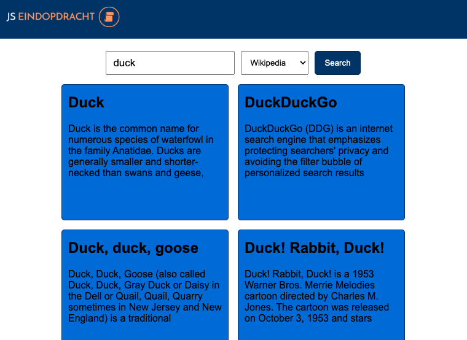

# Eindopdracht JS reader
Dit is een voorbeeld oplossing van de eindracht van de JavaScript reader.

## Stappen om het backend (PHP) voorbeeld te draaien

1. Ga naar de backend map
2. Kopieer `.env.example` naar `.env` en vul de gegevens in (database naam, gebruikersnaam, wachtwoord)
3. Installeer de afhankelijkheden met Composer: `composer install`
4. Maak een tabel aan in de database (minimaal een tabel `item` met een `name` en `cost`)
5. Als je geen XAMPP gebruikt kan je de server starten met: `php -S localhost:8000 api.php`

En dan ben je er. Ga naar de XAMPP locatie in je browser of naar `http://localhost:8000` als je het met bovenstaande server draait.

Bezoek bijvoorbeeld voor de wiki:

(http://localhost:8000/?query=cake&source=wiki)[http://localhost:8000/?query=cake&source=wiki]

Of voor Runescape:

(http://localhost:8000/?query=adamantium&source=rune)[http://localhost:8000/?query=adamantium&source=rune]

## Stappen om het frontend (HTML/CSS/JS) voorbeeld te draaien

1. Ga naar de frontend map
2. Pas de `backend url` aan, bovenin `site.js`
3. Open index.html

## Screenshot

